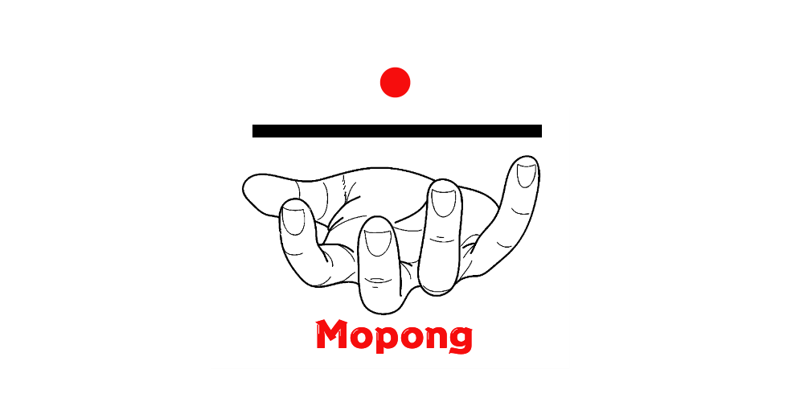

# 🏓 OpenSource Motion Tracking Pong

Welcome to the **MoPong**! 🎉 This interactive game allows players to control a paddle using their hands, keeping a ball in play and scoring points for each successful hit. Built with **Python**, **OpenCV**, and **MediaPipe**, this game provides a fun way to test your reflexes and hand-eye coordination! This Project is a Group Project from School.

<p align="center">
  
</p>

---

## 🎮 Features

✨ **Exciting Gameplay**  
- **Hand Tracking**: Real-time tracking of your hands using MediaPipe for precise paddle control.  
- **Paddle Control**: Simply move your hand to steer the paddle.  
- **Ball Physics**: Enjoy realistic ball movement and bouncing mechanics.  
- **Scoring System**: Track your score dynamically as you play.  
- **Game Over Condition**: Watch out! If the ball hits the bottom, it's game over!  
- **Restart Functionality**: Easily restart the game anytime after a game over.  

---

## 📝 Structure
```
MoPong
├── .idea/
│   ├── inspectionProfiles/
│   │   └── profiles_settings.xml
│   ├── .gitignore
│   ├── misc.xml
│   ├── modules.xml
│   └── ping-pong-main.iml
├── LICENSE
├── README.md
├── main.py
└── mainpage.png
```


## 📝 Changelog
 
## [1.0.0.0] - 2024-10-06
   - Bugfixes
   - Release
 
## [0.3.2.0] - 2023-12-23
   - Camera Motion Fix
   - Paddle Collision Fix
   - Scoring Added
 
## [0.3.1.9a] - 2023-12-20
   - Paddle Tracking
   - Game is now in Windows
   - Camera can now Detect the First Camera
   - Circle not Colliding in the Walls
   - Restart Now Working
   

## 📋 Requirements

Before you Start make sure you have the Included Libraries/Packages
- Numpy
- OpenCV
- MediaPipe

```bash
pip install opencv-python mediapipe numpy
```

---

## 🚀 How to Run

Follow these steps to start playing:

1. **Clone this repository** or download the source code.
2. **Navigate** to the project directory in your terminal or command prompt.
3. **Run the game** using Python:

   ```bash
   python main.py
   ```

4. **Allow access** to your webcam when prompted for an immersive experience!

---

## 🎹 Controls

| Action                | Key Press           |
|-----------------------|---------------------|
| Move Paddle           | Motion of your Hands|
| Restart Game          | Press `R`           |
| Exit Game             | Press `ESC`         |

---

## ⚙️ Game Logic

- The paddle is controlled by your hand position, thanks to MediaPipe's tracking capabilities.  
- The ball bounces around the screen, colliding with walls and the paddle.  
- The game concludes when the ball hits the bottom of the screen.  
- Score points with each successful paddle hit to increase your score!

---

## 🔧 Troubleshooting

If you encounter any issues, consider the following tips:

- Ensure your **webcam** is functioning correctly and permissions are granted.  
- Adjust **lighting conditions** to optimize hand tracking performance.  

---

## 🙏 Acknowledgements

Special thanks to the following libraries and frameworks that made this project possible:

- [OpenCV](https://opencv.org/) - The leading open-source computer vision library.  
- [MediaPipe](https://mediapipe.dev/) - A powerful framework for building multimodal applied ML pipelines.  

---

## 📄 License

This project is licensed under the **MIT License**. For more details, please refer to the [LICENSE](LICENSE) file.

---

## 🌟 Enjoy Playing!

Dive into the game, challenge yourself, and have fun! 🥳 Don't forget to share your high scores!

---
